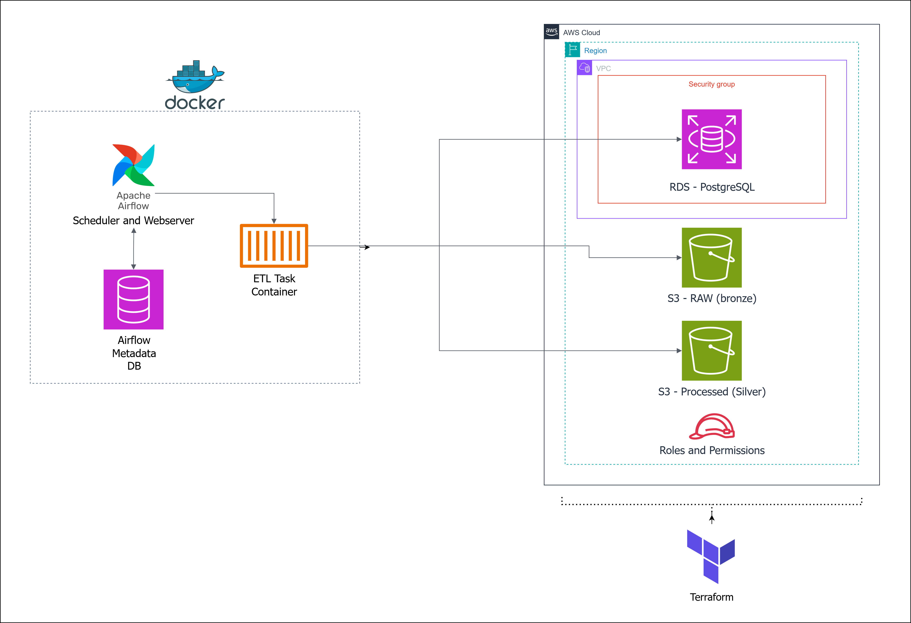
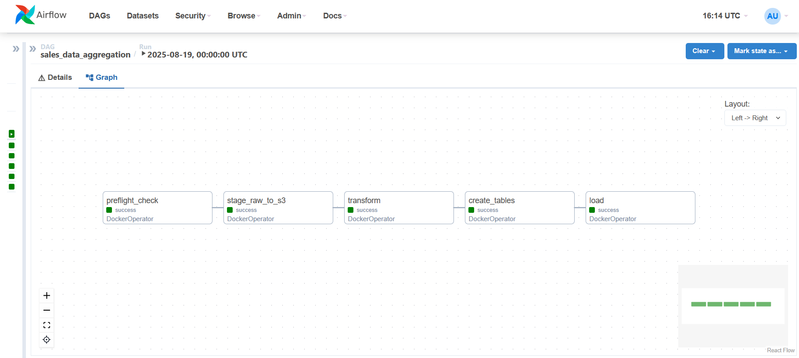

# Sales Data Aggregation Pipeline

## CI

[](https://github.com/AlexLapsin/Sales-Data-Aggregation-Pipeline/actions)


## TL;DR

Sales Data Aggregation Pipeline is an end-to-end, fully containerized ETL pipeline that consolidates regional sales CSV files into a centralized PostgreSQL (RDS) data warehouse with a star schema. It uses Apache Airflow to orchestrate the workflow (extract -> transform -> load) and Terraform to provision all necessary AWS infrastructure (S3 buckets, RDS database, IAM roles). The project mimics a production-ready setup, leveraging Docker for consistent environments and including CI/tests to ensure code quality. In short, this pipeline demonstrates how raw data can be transformed into analytics-ready datasets in a reproducible, cloud-native way.

## Why This Project Exists (Business Context)

In a real-world scenario, a global retail company might receive separate sales reports from different regions (each as CSV files). Manually aggregating these files is error-prone and slow. This project automates the process: each day, new regional sales data is ingested, cleaned, and loaded into a central database. This ensures that stakeholders always have an up-to-date, unified view of sales performance across all regions. The focus here is not only on automation but also on reliability (retries, validations) and scalability (cloud storage & database), reflecting how modern data-driven organizations manage their ETL processes.

## What It Demonstrates (Tech Highlights)

This project is designed to showcase a broad range of data engineering skills and best practices:

- Infrastructure as Code (Terraform): All AWS resources (S3 data lake buckets, Amazon RDS PostgreSQL instance, IAM roles, networking) are created with Terraform modules. This proves ability to manage cloud infrastructure in a reproducible and automated way.
- Cloud-Native Pipeline Design: Raw data is stored in an S3 “data lake” (bronze layer) and transformed data (Parquet files) is stored in a processed bucket (silver layer). The final warehouse is an AWS RDS Postgres database (gold layer). Using S3 and RDS emulates a typical cloud data architecture.
- Apache Airflow Orchestration: The ETL steps are coordinated by an Airflow DAG with proper task ordering and dependencies. Features like retries on failure (2 retries with delay) and error email alerts are configured to mimic production pipelines.
- Dockerized & Portable: Every component runs in Docker containers – from the Airflow scheduler & webserver to the ETL code itself (which runs via Airflow’s DockerOperator). This ensures a consistent environment between development and production, and makes it easy to spin up the entire stack locally.
- Modular ETL Code (Python): The ETL logic is cleanly separated into modular Python functions (extract, transform, load phases). Data transformations use pandas for clarity and brevity. The codebase is structured for readability and testability (e.g., small functions for each transform step).
- Star Schema Output: The pipeline transforms raw transactional data into a star schema (dimensions & fact table) optimized for analytics queries. This demonstrates understanding of data warehousing concepts and how to implement them in practice.
- Preflight Checks & Idempotency: Before running the ETL, a preflight check ensures the S3 buckets and database are reachable. The load process truncates tables and uses upsert logic via staging tables, allowing repeated runs without duplication – important for idempotent pipeline runs.
- CI/CD and Code Quality: The repository includes a GitHub Actions CI workflow that automatically runs linting (flake8), formatting (black), static typing checks (mypy), and pytest for unit tests on every push. This highlights a commitment to code quality and maintainability in engineering projects.
- Documentation & Maintainability: Configuration is externalized in environment files (.env), an example config is provided, and the README (you’re reading) serves as comprehensive documentation. The project is structured to be easy to navigate for reviewers (logical directories and naming).

## Architecture

The diagram below illustrates the high-level architecture of the pipeline and data flow:



**DAG**



<small>Architecture: Dockerized Airflow manages a DAG that moves data from local CSV files to S3 (raw), processes it into Parquet on S3 (processed), and loads it into an AWS RDS PostgreSQL database. Terraform provisions the S3 buckets, RDS instance, and IAM roles/policies. The final data model in Postgres is a star schema with fact and dimension tables.</small>

## Tech Stack

Language & Libraries: Python 3.11 (pandas, boto3 for AWS, psycopg2 for Postgres, dotenv), SQL (PostgreSQL).
Orchestration: Apache Airflow 2.6 (with DockerOperator for running tasks in Docker containers).
Infrastructure: Terraform (v1.x) for AWS provisioning; AWS services – S3, RDS (Postgres 15), IAM, VPC/Security Groups.
Containers: Docker & Docker Compose for local deployment (custom Docker images for Airflow and ETL tasks).
DevOps & CI: GitHub Actions for continuous integration (lint, test, build), Pre-commit hooks (formatting, linting), and Pytest for unit tests (with coverage reports).

## Repository Structure

```text
├── airflow/
│   ├── dags/                   # Airflow DAG definition for the pipeline
│   ├── postgres/               # Mounted volume for Airflow's local Postgres metadata DB
│   └── ... (Airflow configs, logs, etc.)
├── infra/                      # Infrastructure-as-code (Terraform)
│   ├── main.tf, outputs.tf     # Terraform root module (invokes submodules)
│   └── modules/                # Terraform modules for organization
│       ├── storage/            # S3 buckets (raw & processed)
│       ├── database/           # RDS PostgreSQL instance & subnet group
│       ├── network/            # Security group, network config (uses default VPC)
│       └── iam/                # IAM role & policy for ETL access to S3/RDS
├── src/
│   ├── etl/                    # Core ETL logic (functions for extract, transform, load)
│   │   ├── extract_funcs.py    # Functions to list & fetch data from S3
│   │   ├── transform_funcs.py  # Data cleaning and transformation functions (pandas)
│   │   └── load_funcs.py       # Functions to read Parquet from S3 and DB connection helpers
│   └── scripts/                # Executable scripts for each pipeline step
│       ├── preflight_check.py  # Step 1: Validate S3 and DB connectivity
│       ├── upload_data.py      # Step 2: Upload local CSVs to S3 (raw layer)
│       ├── run_transform.py    # Step 3: Transform data and save Parquets to S3 (processed layer)
│       ├── create_tables.py    # Step 4: Ensure RDS target tables exist (star schema DDL)
│       └── run_load.py         # Step 5: Load Parquets from S3 into RDS (fact & dimension tables)
├── tests/                      # Unit tests for ETL functions (e.g., data transformations)
├── Dockerfile                  # Docker image for ETL tasks (Python environment with dependencies)
├── Dockerfile-airflow          # Docker image for Airflow (installs needed providers like DockerOperator)
├── docker-compose.yml          # Docker Compose configuration (Airflow, Postgres, and ETL container services)
├── .env.example                # Example environment variable configuration for running the project
└── export_tf_vars.sh           # Helper script to export .env values as TF_VAR_… for Terraform
```

## Quickstart – Running the Pipeline Locally

Follow these steps to set up and run the project on your local machine. This will launch an Airflow instance and execute the ETL pipeline against your AWS account (for S3/RDS resources):

**Prerequisites:** Install Docker (with Docker Compose), Terraform (v1.5+), and ensure you have an AWS account with credentials configured. You’ll need an AWS Access Key and Secret Key with permissions to create S3 buckets, RDS, etc.

**Clone & Configure:** Clone this repository to your machine. Copy the file `.env.example` to `.env` in the project root. Open the `.env` file and fill in required values:
- AWS credentials: `AWS_ACCESS_KEY_ID`, `AWS_SECRET_ACCESS_KEY` (or ensure your AWS CLI is configured; see note below).
- AWS region: `AWS_DEFAULT_REGION` (e.g., `us-east-1`).
- Unique S3 bucket names for raw and processed data: `S3_BUCKET` and `PROCESSED_BUCKET` (these must be globally unique across AWS).
- Desired RDS database name, user, and a strong password: `RDS_DB`, `RDS_USER`, `RDS_PASS`.
- `ALLOWED_CIDR`: your machine’s public IP in CIDR notation (e.g., `203.0.113.0/32`) – this lets your local Docker containers connect to the new RDS instance.
- (You can leave `RDS_HOST` empty for now – you’ll fill it after Terraform creates the DB.)
- Adjust any other settings if needed (or use defaults), such as `PROJECT_NAME`, `ENVIRONMENT`, instance size, etc.

**Provision AWS Infrastructure (Terraform):** Open a terminal in the project folder and run:
```bash
# Expose .env values as Terraform variables
source export_tf_vars.sh
# Initialize and apply Terraform configuration
cd infra && terraform init && terraform apply
```
Terraform will ask for confirmation and then create the AWS resources. Upon success, note the outputs – especially the `db_endpoint`. Update your `.env` file with `RDS_HOST` set to the endpoint of the new RDS instance. (You can retrieve it anytime with `terraform output db_endpoint`.)

**Place Raw Data Files:** Prepare some sample sales CSV files and place them in the `data/raw/` directory of the project. The pipeline expects multiple CSVs named like `*_orders.csv` (for example, `Asia_Pacific_orders.csv`, `North_America_orders.csv`, etc.), each containing regional sales data with a consistent schema. (If you don’t have your own data, you can use a public sample like the “Superstore” dataset, splitting it by region for realism. Ensure columns like Order Date, Ship Date, Sales, Profit, etc., are present.)

**Build & Launch the Pipeline:** Start the Dockerized pipeline by running:
```bash
# From the project root
docker-compose up --build
```
This will build the custom Docker images and start three containers: Airflow, a Postgres container (for Airflow’s metadata), and an idle ETL container (which provides the image for tasks). The Airflow web server will be accessible at http://localhost:8080 (username: `admin`, password: `admin` by default, configurable in `.env`). Wait a minute or two for the Airflow services to fully initialize.

**Run the ETL DAG:** In the Airflow UI, you'll see a DAG called `sales_data_aggregation`. Unpause it (toggle on) and trigger a run (via the "Trigger DAG" button). This will execute all pipeline tasks in order. You can monitor progress in the Airflow UI's Graph or Tree view. Each task logs its actions (e.g., how many files uploaded, number of records processed) which you can inspect in the Airflow logs.

**Verify Results:** After a successful DAG run, the sales data should be loaded into the PostgreSQL database. You can connect to the RDS instance to verify:
- Airflow UI: Use Airflow’s built-in Database view or logs (if configured) to see task outputs.
- SQL Client: Using a SQL tool or the psql client (installed in the ETL Docker image), connect to the RDS host with credentials from your `.env`. For example:
```bash
psql -h <RDS_HOST> -p 5432 -d sales -U salesuser
```
Once connected, run queries like `SELECT * FROM dim_product;` or `SELECT COUNT(*) FROM fact_sales;` to see the data. The fact table should contain combined sales records, with foreign keys linking to populated `dim_date` and `dim_product` tables.

> Note: If you prefer not to use Airflow, you can also run the pipeline steps manually using the Python scripts (e.g., `python src/scripts/preflight_check.py`, then `upload_data.py`, etc., in sequence). However, using Airflow via Docker Compose is recommended to fully experience the orchestration and dependency management.

## Configuration Details

<details><summary><strong>Click to view configuration variables</strong></summary>

This project is configured via environment variables (see the `.env` file). Key variables include:

| Variable | Description |
|---|---|
| AWS_ACCESS_KEY_ID<br>AWS_SECRET_ACCESS_KEY | AWS credentials that Airflow and ETL code use to access S3 and RDS. These can be set in the `.env` for local runs. (Alternatively, you can rely on AWS CLI default credentials on your system; the code will pick up credentials from the environment or IAM role if running in AWS.) |
| AWS_DEFAULT_REGION | AWS region where resources will be created and accessed. Example: `us-east-1`. Make sure it matches the region you want to use for S3/RDS. |
| S3_BUCKET | Name of the S3 bucket for raw input data (the “bronze” layer). Must be globally unique. Terraform will create this bucket. |
| PROCESSED_BUCKET | Name of the S3 bucket for processed Parquet data (the “silver” layer). Terraform will create this bucket. |
| RDS_HOST | Endpoint/host of the PostgreSQL database (set by Terraform output). This is filled into `.env` after you create the RDS instance. |
| RDS_PORT | Port for the Postgres DB (default `5432`). |
| RDS_DB | Database name in RDS (e.g., `sales`). The pipeline will create tables inside this database. |
| RDS_USER | Database username (e.g., `salesuser`). This user is created for the RDS instance via Terraform. |
| RDS_PASS | Database password for the above user. Set this in `.env` before running Terraform so the RDS instance is created with it. |
| ALLOWED_CIDR | A CIDR range that will be allowed to connect to the RDS database. Typically set this to your development machine’s public IP with `/32`. Terraform uses this to configure the DB security group. |
| SALES_THRESHOLD | A numeric threshold for “extreme” sales values. During transformation, any sales above this value are treated as outliers and filtered out. (Default is `10000` in the example `.env`.) |
| HOST_DATA_DIR | Filesystem path on your host machine to the `data` directory containing raw CSV files. This is used to mount the data into the Docker container. For example, `/Users/<you>/Projects/Sales-Data-Aggregation-Pipeline/data` on Mac, or a similar path on Windows (use absolute path). Correctly setting this ensures the Docker container can read your CSV files. |
| PIPELINE_IMAGE | Name (and tag) of the Docker image used for the ETL tasks. By default it’s `sales-pipeline:latest` (built from the included `Dockerfile`). If you were to push this image to a registry, you could change this to pull a remote image. |
| Additional Terraform variables | The `.env` also contains variables for tuning the Terraform deployment (e.g., `DB_INSTANCE_CLASS` for RDS size, backup retention, etc.). These are exported by `export_tf_vars.sh`. In most cases, the defaults (a small `db.t3.micro` instance, etc.) are sufficient for demo purposes. |

Note: The example `.env` file in the repo provides a template with all these variables. For security, never commit your actual `.env` (with real AWS keys or passwords) to source control.

</details>

## How It Works – ETL Pipeline Breakdown

The Airflow DAG (`sales_data_aggregation`) defines a sequence of five tasks that together perform the end-to-end ETL:

**Preflight Check: ("Can we talk to AWS?")**

Before any heavy lifting, the pipeline runs a connectivity check. This step uses AWS SDK (boto3) and a Postgres client to ensure:
- The S3 raw bucket is reachable and the AWS credentials are valid (it attempts to list the bucket contents).
- The RDS database is accepting connections (tries a simple connect-and-close).
This fails fast if something is misconfigured (e.g., incorrect credentials, missing bucket, or the DB is unreachable), saving time and making troubleshooting easier. If everything is okay, the DAG moves on.

**Stage Raw Data to S3: ("Get the raw files into the cloud")**

In this step, the pipeline takes all CSV files from the local `data/raw/` folder and uploads them to the S3 raw bucket. Each file is uploaded with an optional prefix (the DAG uses a date-based prefix like `runs/2025-08-20/` for organization, though you can configure this). Key points:
- It's essentially the “extract” phase, though here we’re simulating extraction by reading local files (as if they were provided by regional teams) and pushing them to a cloud data lake.
- If no CSV files are found, the task will log a warning and do nothing (which would result in no data for subsequent steps).
- After this step, all regional CSVs reside in S3 (bronze layer), enabling the next steps to run in the cloud environment.

**Transform & Write Parquet: ("Clean and shape data into a star schema")**

The transformation step is where raw data becomes analytics-friendly. Here’s what happens:
- The task lists all CSV files in the S3 raw bucket (from the prefix set earlier) and downloads them in-memory using pandas.
- It concatenates all regional data into one DataFrame, then applies a series of data cleaning functions:
  - Parse dates into proper datetime objects (invalid dates become NaN).
  - Remove obviously bad records (e.g., negative or zero quantities, null essential fields).
  - Filter out extreme outliers in sales (any record with Sales > SALES_THRESHOLD is dropped to focus on typical orders).
  - Derive new fields like unit_price (e.g., sales divided by quantity) and profit_margin (profit divided by sales), adding more insights per record.
  - Rename columns to a consistent format (lowercase, underscored names, e.g., "Order Date" -> order_date, "Sales" -> total_sales, etc.).
- After cleaning, the code splits the DataFrame into a star schema:
  - dim_date: unique order dates along with day, month, quarter, year (for date-based analyses).
  - dim_product: unique products with their category (assuming each product ID falls under a category in the data).
  - fact_sales: the fact table linking a date and product to the metrics (quantity sold, total sales, profit, etc.), plus the derived metrics.
- Each of these three tables is written to the processed S3 bucket as a Parquet file. Parquet is used for its efficiency in storage and downstream loading.
- At this point, the “silver” layer (processed data) is created on S3: we have dimension and fact datasets ready to load into the database.

**Create Tables in RDS: ("Ensure the database schema is ready")**

Before loading data into Postgres, this step runs SQL DDL to create the target tables if they don’t already exist. It’s an idempotent operation (safe to run multiple times). Specifically, it creates:
- dim_date table with columns for date and its components (with a surrogate primary key).
- dim_product table for product identifiers and categories (with a surrogate key).
- fact_sales table with foreign keys referencing the two dimension tables and columns for quantity, sales, profit, etc.
This step ensures that even if the pipeline runs against a fresh database, the necessary schema will be in place for the load. (If the tables exist from a previous run, the CREATE TABLE IF NOT EXISTS simply does nothing, so the pipeline can run repeatedly without issues.)

**Load Data into RDS: ("Populate the warehouse with new data")**

This is the final step where the Parquet files from S3 are loaded into the Postgres data warehouse (the “gold” layer):
- The task reads each Parquet file from the processed S3 bucket directly into a pandas DataFrame (using AWS credentials).
- For performance, it uses Postgres’s COPY command to bulk-load data. Here’s how it works for each table:
  - Dimensions: The code truncates the existing dim_date and dim_product tables (since we’re doing a full reload in this design) and then copies the new data in. It excludes the surrogate keys in the copy (so they auto-generate). This ensures dimension tables match exactly the data prepared in S3.
  - Fact Table: To handle foreign keys, it doesn’t load directly into fact_sales. Instead:
    - Creates a temporary staging table that mirrors the structure of fact_sales but with natural keys (date and product ID instead of their surrogate keys).
    - Copies the fact DataFrame into this staging table.
    - Runs a SQL INSERT ... SELECT query joining the staging data with dim_date and dim_product to translate dates and product IDs into their surrogate keys. This populates fact_sales correctly linking to the dimensions.
    - (The staging table is dropped automatically at the end of the transaction.)
- All these operations run in a transaction. If anything fails mid-way, it will rollback to keep the database consistent.
- On success, the new data is committed. The result: the RDS Postgres now contains three tables in a star schema, with fresh data ready for analysis. You can, for example, join fact_sales with dim_date or dim_product to answer business questions like “How do sales trend over the months?” or “Which product categories drive the most profit?”.
- Since this pipeline is designed to mimic daily batches, it’s currently loading all data from scratch each run. In a real scenario, we might append only new data or use partitions, but the full refresh approach keeps things simple for demonstration.

Throughout the above steps, Airflow handles scheduling and error handling:
- If any step fails, downstream steps won’t run. The DAG’s default settings will retry a failed task up to 2 times (with a 10-minute delay between retries), providing resilience against transient issues.
- Logging is captured for each task (visible in Airflow UI), which is invaluable for debugging or verifying what happened during each run.
- The tasks run in isolated Docker containers (thanks to DockerOperator), so the Python environment for the ETL is separate from Airflow’s environment. This mirrors how production Airflow often runs tasks on worker containers and helps avoid dependency conflicts.

## Troubleshooting & Tips

<details><summary><strong>Common Issues and Solutions (click to expand)</strong></summary>

Terraform errors (bucket name already taken, etc.): S3 bucket names must be globally unique. If terraform apply fails due to bucket name, choose a different name in your .env for S3_BUCKET/PROCESSED_BUCKET and try again. Also ensure your AWS credentials are correct and have rights to create resources (S3, RDS).

Cannot connect to Postgres (RDS) from Airflow: If the load task fails to connect to the database, double-check that the security group allows access from your machine. The ALLOWED_CIDR in .env should be your actual IP when you ran Terraform. If your IP changed (common on home networks), the RDS might be blocking you. You can fix this by updating ALLOWED_CIDR and running terraform apply again to update the security group rule.

Airflow webserver issues or DAG not showing: Ensure Docker containers are running (docker-compose ps). The Airflow container may take a bit to initialize. If the DAG doesn’t appear, confirm that airflow/dags/sales_data_pipeline_dag.py is mounted in the container (Compose should mount the folder). You might need to restart the containers if the DAG was added after Airflow started.

No CSV files found / Pipeline does nothing: The upload step might log “No CSV files found” – this means your data/raw folder is empty or not mounted correctly. Make sure you placed the CSV files in the correct path and that HOST_DATA_DIR in .env points to the absolute path of the data folder. On Windows, check the path formatting carefully. After adding files, you can re-run the upload_data task (or the whole DAG) to process them.

AWS credential issues: If Airflow tasks error out with AWS permission or credential issues, ensure the AWS keys are present in the Airflow container’s environment. The env_file: .env in Docker Compose should handle this. Alternatively, if you prefer using an AWS profile, you might not fill in keys in .env; in that case, remove the keys from .env and ensure your AWS CLI profile is configured on your system. The provided export_tf_vars.sh will skip setting keys if an AWS_PROFILE is detected, allowing the containers to rely on your local AWS config.

Cleaning up: After you’re done, you can tear down resources to avoid costs. Use docker-compose down to stop the local Airflow and terraform destroy (within infra/) to delete the AWS infrastructure (S3 buckets, RDS, etc.). Be careful: the S3 buckets will be emptied and removed (the Terraform config has force_destroy = true for demo convenience). If you want to keep the data, consider manually downloading it before destroying.

</details>

## Roadmap and Future Improvements

While the current implementation achieves its goal, there are many ways to extend or improve this project:
- Incremental/Data Updates: Currently, the pipeline reloads all data each run. In a production setting, we’d optimize this by processing only new data (e.g., partition by date, and append to fact table or use upsert logic for changes).
- Larger Scale & Big Data Tech: For very large datasets, using Spark or AWS Glue for transformations instead of pandas would be more scalable. Integration with big data tools (Spark, Hive, Presto) or moving to a data warehouse like Redshift could be explored.
- Airflow Deployment: The Airflow instance here is local. As a next step, one could deploy this DAG to a cloud-managed Airflow service (AWS MWAA) or run Airflow on Kubernetes for a truly production-grade setup.
- Monitoring & Alerting: Integrate with monitoring systems. For example, push Airflow logs to CloudWatch, set up Airflow alert emails (so failures send notifications beyond the owner), and add data quality checks (failed checks could trigger alerts).
- Data Lake Catalog: Add a data catalog or schema registry for the data in S3 (e.g., using AWS Glue Data Catalog or Hive Metastore) so that the Parquet files can be queried directly (using tools like Amazon Athena) even before loading to Postgres.
- Additional Data Sources/Targets: Extend the pipeline to pull data from an API or another database to simulate a more complex extract. Or load the results into a visualization tool or dashboard for end-to-end demo.
- Docker and DevX: Containerize the Terraform deployment as well (to avoid local Terraform install), and possibly use Docker Compose profiles or a Makefile for one-command setup. Also, consider adding volume mounts for persistent Airflow state if needed.
- Security Enhancements: Store sensitive credentials in a secrets manager instead of .env (for prod, never store real secrets in plain text). Also, run the RDS in a private subnet and use a bastion or port forwarding for access, rather than opening to a public CIDR.

## Reviewer's Guide (What to Look At)

If you’re reviewing this project, here are the key areas to explore in the repository:
- DAG Definition: Start with airflow/dags/sales_data_pipeline_dag.py. This shows how the pipeline is orchestrated (task definitions, order of execution, and retry logic). It gives a quick overview of the ETL steps.
- ETL Code: Check out the src/etl/ folder for the core logic, especially transform_funcs.py to see the data cleaning steps and business rules. The src/scripts/ folder ties these functions into runnable steps. This separation shows an effort to keep business logic separate from orchestration.
- Infrastructure as Code: Look at the infra/ directory and its submodules:
  - infra/modules/storage defines S3 buckets (with security configurations like no public access and SSE encryption).
  - infra/modules/database defines the RDS instance (see how credentials and connectivity are handled).
  - infra/modules/iam defines an IAM role and policy (demonstrating principle of least privilege for the ETL to access only the needed S3 buckets and RDS).
  - This will illustrate the candidate’s ability to automate cloud setup.
- Testing and CI: Open the tests/ folder (e.g., tests/test_transform.py) to see examples of how the data transformation logic is validated. The presence of tests and a CI pipeline (.github/workflows/main.yml) indicates emphasis on code quality. The CI config will show you exactly which checks are run.
- Docker & Config: Inspect the Dockerfile (for the ETL image) and docker-compose.yml. You’ll see how the environment is configured and how the Airflow and task containers interact (notice the Docker socket volume for DockerOperator, etc.). It demonstrates understanding of containerization and local dev tooling.
By examining these components, you should get a sense of the thought process behind the project structure and the engineering practices demonstrated.

## Author

Alexandru Lapsin – I designed and developed this project from scratch as a personal endeavor to showcase my data engineering skills. All code, architecture decisions, and deployment steps were implemented by me. Please feel free to reach out if you have questions or feedback!

## License

This project is open source and available under the MIT License. See the LICENSE file for details.
