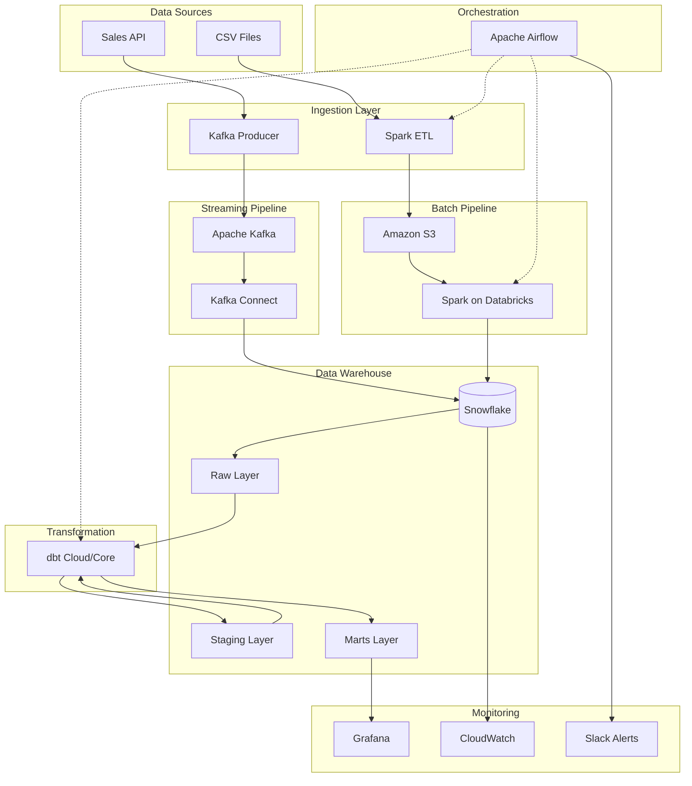

# Cloud Sales Data Pipeline

## Overview

This is a production-ready, cloud-native sales data aggregation pipeline that combines real-time streaming and batch processing to deliver analytics-ready data. The pipeline leverages modern data engineering tools and follows best practices for scalability, reliability, and maintainability.

## Architecture

### High-Level Architecture



### Technology Stack

| Component | Technology | Purpose |
|-----------|------------|---------|
| **Streaming** | Apache Kafka + Kafka Connect | Real-time data ingestion |
| **Batch Processing** | Apache Spark + Databricks | Large-scale data processing |
| **Data Warehouse** | Snowflake | Cloud data warehouse |
| **Transformations** | dbt (Data Build Tool) | SQL-based transformations |
| **Orchestration** | Apache Airflow | Workflow management |
| **Infrastructure** | Terraform | Infrastructure as Code |
| **Containerization** | Docker + Docker Compose | Application packaging |
| **Monitoring** | Grafana + CloudWatch | Observability and alerting |

## Project Structure

```
sales_data_aggregation_pipeline/
├── airflow/                    # Airflow DAGs and configuration
│   └── dags/
│       ├── cloud_sales_pipeline_dag.py    # Main pipeline DAG
│       ├── pipeline_monitoring_dag.py     # Monitoring DAG
│       └── maintenance_dag.py             # Maintenance DAG
├── dbt/                       # dbt project for transformations
│   ├── models/
│   │   ├── staging/          # Clean and standardize raw data
│   │   ├── intermediate/     # Business logic and SCD2
│   │   └── marts/           # Final dimensional model
│   ├── macros/              # Custom dbt macros
│   ├── tests/               # Data quality tests
│   └── dbt_project.yml      # dbt configuration
├── spark/                    # Spark ETL jobs
│   ├── sales_batch_job.py   # Main batch processing job
│   ├── notebooks/           # Databricks notebooks
│   ├── spark_config.py      # Environment configurations
│   └── test_spark_job.py    # Testing framework
├── streaming/               # Kafka streaming components
│   ├── kafka_producer.py    # Real-time data producer
│   ├── connectors/          # Kafka Connect configurations
│   └── docker-compose-connect.yml
├── snowflake/              # Snowflake DDL and setup
│   ├── 01_database_setup.sql
│   ├── 02_raw_tables.sql
│   ├── 03_dimensional_tables.sql
│   └── 04_fact_tables.sql
├── infra/                  # Terraform infrastructure
│   ├── modules/
│   ├── environments/
│   └── main.tf
├── deployment/             # Deployment scripts and configs
│   ├── deploy.sh           # Main deployment script
│   └── terraform-outputs/
├── docker/                 # Docker configurations
├── monitoring/             # Monitoring and alerting
└── docs/                  # Documentation
```

## Quick Start

### Prerequisites

1. **Cloud Accounts**:
   - AWS Account with appropriate permissions
   - Snowflake Account (trial available)
   - Databricks Account (community edition available)

2. **Local Tools**:
   - Docker and Docker Compose
   - Terraform >= 1.0
   - AWS CLI configured
   - Python 3.9+

3. **Optional**:
   - dbt CLI (for local development)
   - Spark CLI (for local testing)

### Setup

1. **Clone and Configure**:
   ```bash
   git clone <repository>
   cd sales_data_aggregation_pipeline

   # Copy and customize configuration
   cp .env.example .env
   # Edit .env with your credentials and settings
   ```

2. **Deploy Infrastructure**:
   ```bash
   # Deploy all infrastructure
   ./deployment/deploy.sh full

   # Or deploy components individually
   ./deployment/deploy.sh infrastructure
   ./deployment/deploy.sh snowflake
   ./deployment/deploy.sh dbt
   ```

3. **Start Local Development**:
   ```bash
   # Start Kafka for streaming
   docker-compose -f docker-compose-cloud.yml --profile kafka-local up -d

   # Start dbt for transformations
   docker-compose -f docker-compose-cloud.yml --profile dbt-local up -d

   # Start monitoring
   docker-compose -f docker-compose-cloud.yml --profile monitoring up -d
   ```

4. **Test the Pipeline**:
   ```bash
   # Test Kafka producer
   cd streaming
   python kafka_producer.py --config producer_config.json

   # Test Spark ETL
   cd spark
   python test_spark_job.py

   # Test dbt transformations
   cd dbt
   dbt run --target dev
   dbt test
   ```

## Data Flow

### Streaming Pipeline

1. **Data Generation**: Sales events generated by `kafka_producer.py`
2. **Kafka Ingestion**: Events published to `sales_events` topic
3. **Kafka Connect**: Snowflake Sink Connector streams data to `SALES_RAW` table
4. **Real-time Processing**: Data available for transformations within seconds

### Batch Pipeline

1. **Data Extraction**: CSV files uploaded to S3
2. **Spark Processing**: `sales_batch_job.py` processes files on Databricks
3. **Data Loading**: Cleaned data loaded to `SALES_BATCH_RAW` table
4. **Daily Processing**: Scheduled via Airflow DAG

### Transformation Pipeline

1. **Staging Layer**: Clean and standardize raw data using dbt
2. **Intermediate Layer**: Apply business logic and implement SCD2
3. **Marts Layer**: Generate final dimensional model
4. **Data Quality**: Comprehensive testing at each layer

## Configuration

### Environment Variables

Key configuration variables in `.env`:

```bash
# AWS Configuration
AWS_ACCESS_KEY_ID=your_access_key
AWS_SECRET_ACCESS_KEY=your_secret_key
AWS_DEFAULT_REGION=us-east-1
S3_BUCKET=your-raw-data-bucket
PROCESSED_BUCKET=your-processed-data-bucket

# Snowflake Configuration
SNOWFLAKE_ACCOUNT=your-account.region.aws
SNOWFLAKE_USER=your-username
SNOWFLAKE_PASSWORD=your-password
SNOWFLAKE_DATABASE=SALES_DW
SNOWFLAKE_WAREHOUSE=COMPUTE_WH

# Databricks Configuration
DATABRICKS_HOST=https://your-workspace.cloud.databricks.com
DATABRICKS_TOKEN=your-access-token

# Kafka Configuration
KAFKA_BOOTSTRAP_SERVERS=localhost:9092
KAFKA_TOPIC=sales_events
```

### Terraform Variables

Infrastructure configuration in `infra/environments/`:

```hcl
# Environment-specific variables
project_name = "sales-data-pipeline"
environment = "dev"
aws_region = "us-east-1"

# Enable/disable components
enable_msk = false          # Use local Kafka for dev
enable_snowflake_objects = true
```

## Monitoring and Alerting

### Data Quality Monitoring

- **dbt Tests**: Automated data quality tests
- **Custom Metrics**: Business rule validation
- **Trend Analysis**: Quality score monitoring over time
- **Automated Alerts**: Slack/email notifications for issues

### Pipeline Monitoring

- **Airflow DAGs**: Pipeline execution monitoring
- **Grafana Dashboards**: Real-time metrics visualization
- **CloudWatch**: AWS resource monitoring
- **Performance Tracking**: Query execution times and resource usage

### Health Checks

- **Service Availability**: Kafka, Snowflake, Databricks status
- **Data Freshness**: Monitoring data ingestion delays
- **Error Rate Tracking**: Failed jobs and data quality issues
- **Capacity Monitoring**: Storage and compute utilization

## Development Guide

### Local Development

1. **Streaming Development**:
   ```bash
   # Start Kafka cluster
   docker-compose --profile kafka-local up -d

   # Test producer
   python streaming/kafka_producer.py

   # Monitor with Kafka UI
   open http://localhost:8080
   ```

2. **dbt Development**:
   ```bash
   # Start dbt container
   docker-compose --profile dbt-local up -d

   # Run models
   docker exec -it sales-dbt-dev dbt run
   docker exec -it sales-dbt-dev dbt test

   # Generate docs
   docker exec -it sales-dbt-dev dbt docs generate
   docker exec -it sales-dbt-dev dbt docs serve --port 8080
   ```

3. **Spark Development**:
   ```bash
   # Start Spark container
   docker-compose --profile spark-local up -d

   # Test jobs locally
   python spark/test_spark_job.py

   # Monitor Spark UI
   open http://localhost:4040
   ```

### Testing

1. **Unit Tests**:
   ```bash
   # Python tests
   python -m pytest tests/

   # dbt tests
   dbt test --target dev

   # Spark tests
   python spark/test_spark_job.py
   ```

2. **Integration Tests**:
   ```bash
   # End-to-end pipeline test
   ./deployment/deploy.sh tests
   ```

3. **Data Quality Tests**:
   ```bash
   # Run comprehensive dbt tests
   dbt test --select source:*
   dbt test --select staging
   dbt test --select marts
   ```

## Deployment Guide

### Production Deployment

1. **Infrastructure**:
   ```bash
   # Set environment
   export ENVIRONMENT=prod

   # Deploy infrastructure
   ./deployment/deploy.sh infrastructure
   ```

2. **Application**:
   ```bash
   # Build and push images
   ./deployment/deploy.sh docker

   # Deploy dbt models
   ./deployment/deploy.sh dbt

   # Setup monitoring
   ./deployment/deploy.sh monitoring
   ```

3. **Validation**:
   ```bash
   # Run all tests
   ./deployment/deploy.sh tests

   # Verify pipeline health
   curl -X GET "https://your-airflow.com/api/v1/dags/cloud_sales_pipeline/dagRuns"
   ```

### Scaling Considerations

1. **Kafka**: Use AWS MSK for production
2. **Spark**: Scale Databricks cluster based on data volume
3. **Snowflake**: Use appropriate warehouse sizes
4. **dbt**: Consider dbt Cloud for better scaling
5. **Airflow**: Use managed Airflow (MWAA) for production

## Maintenance

### Regular Tasks

1. **Data Cleanup**: Automated via `maintenance_dag.py`
2. **Performance Tuning**: Weekly optimization tasks
3. **Schema Evolution**: Managed through dbt versioning
4. **Resource Optimization**: Cost monitoring and rightsizing

### Troubleshooting

1. **Kafka Issues**:
   ```bash
   # Check Kafka Connect status
   curl http://localhost:8083/connectors/snowflake-sink/status

   # Restart connector
   curl -X POST http://localhost:8083/connectors/snowflake-sink/restart
   ```

2. **Spark Issues**:
   ```bash
   # Check Spark logs
   databricks workspace ls /path/to/logs

   # Monitor resource usage
   spark-submit --conf spark.eventLog.enabled=true
   ```

3. **dbt Issues**:
   ```bash
   # Debug connection
   dbt debug

   # Run specific models
   dbt run --select model_name

   # Check logs
   cat logs/dbt.log
   ```

## Security

### Data Security

- **Encryption**: All data encrypted in transit and at rest
- **Access Control**: Role-based access using cloud IAM
- **Network Security**: VPC endpoints and private networking
- **Audit Logging**: Comprehensive access and change logging

### Secrets Management

- **AWS Secrets Manager**: Database credentials
- **Environment Variables**: Non-sensitive configuration
- **Docker Secrets**: Container-level secret management
- **Key Rotation**: Automated credential rotation

## Cost Optimization

### Resource Management

- **Auto-scaling**: Databricks and Snowflake auto-scaling
- **Spot Instances**: Use spot instances for batch processing
- **Storage Tiering**: Automated S3 lifecycle policies
- **Warehouse Suspension**: Snowflake auto-suspend configuration

### Monitoring

- **Cost Dashboards**: Real-time cost tracking
- **Budget Alerts**: Automated budget notifications
- **Resource Tagging**: Comprehensive cost allocation
- **Optimization Recommendations**: Automated rightsizing

## Contributing

1. **Development Process**:
   - Fork repository
   - Create feature branch
   - Develop and test locally
   - Submit pull request
   - Deploy to staging
   - Validate and promote to production

2. **Code Standards**:
   - Follow PEP 8 for Python
   - Use dbt style guide for SQL
   - Include comprehensive tests
   - Document all changes
   - Use semantic versioning

## Support

### Resources

- **Documentation**: Comprehensive docs in `/docs`
- **dbt Docs**: Generated documentation at runtime
- **Monitoring**: Grafana dashboards and alerts
- **Logs**: Centralized logging in CloudWatch

### Getting Help

- **Issues**: GitHub Issues for bug reports
- **Discussions**: GitHub Discussions for questions
- **Slack**: Internal team Slack channel
- **Documentation**: Check README and docs/ folder

## License

[Specify your license here]

---

**Note**: This pipeline demonstrates modern data engineering best practices and can be adapted for various use cases. The architecture is designed to be modular, scalable, and maintainable.
